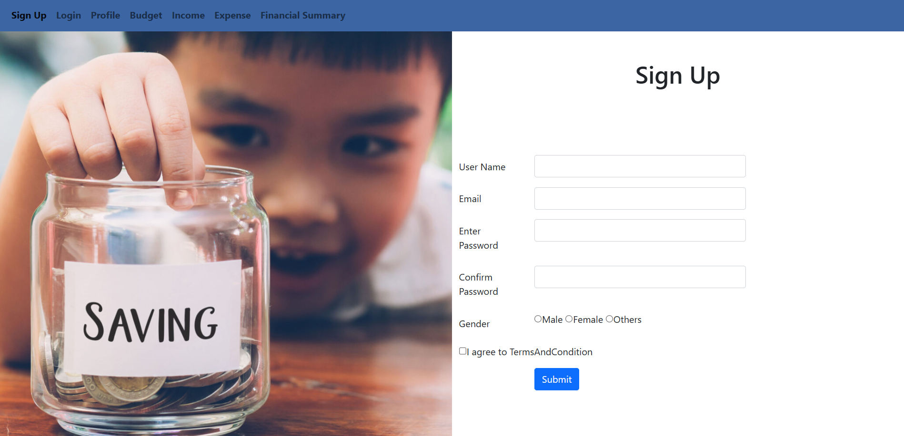
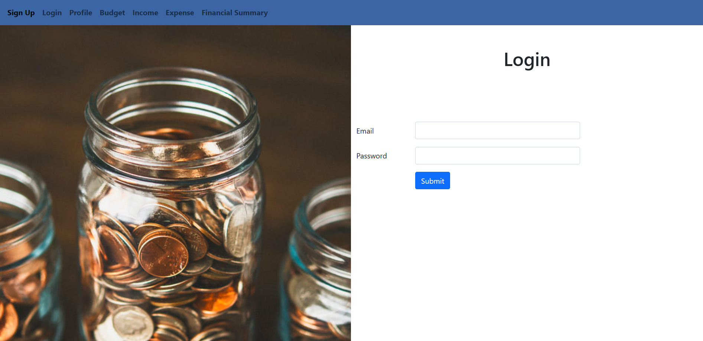
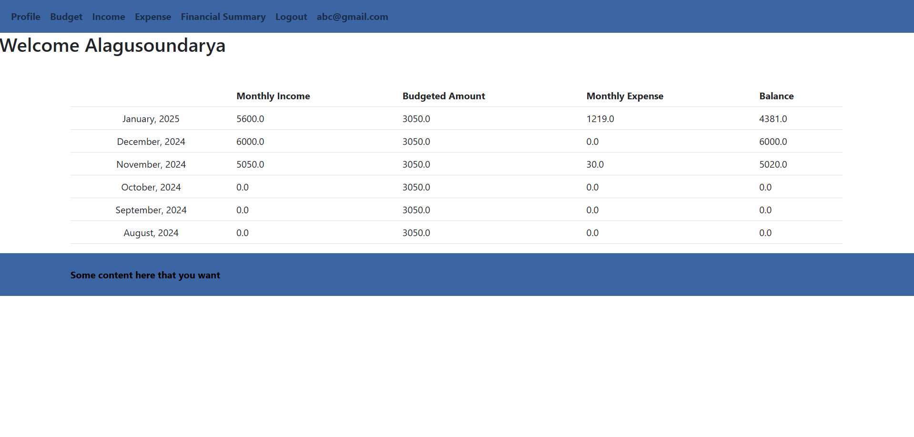
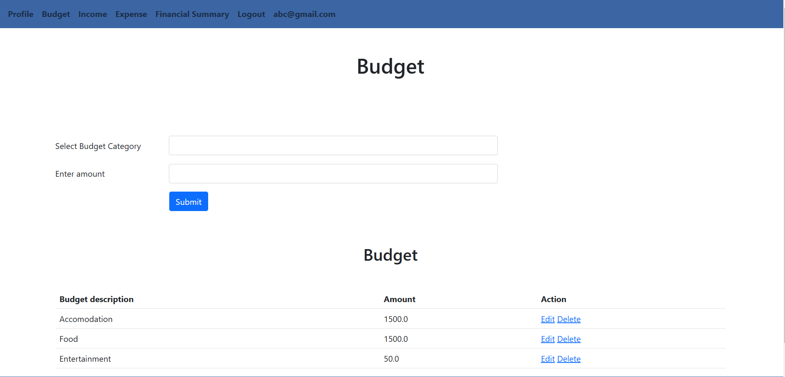
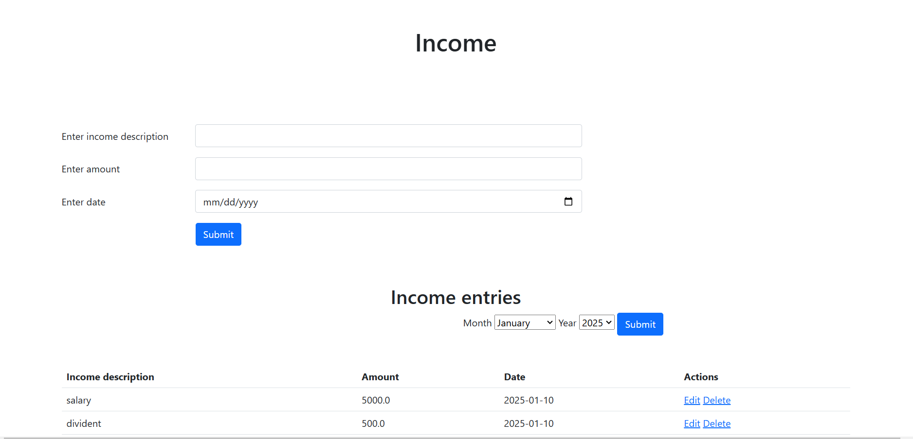
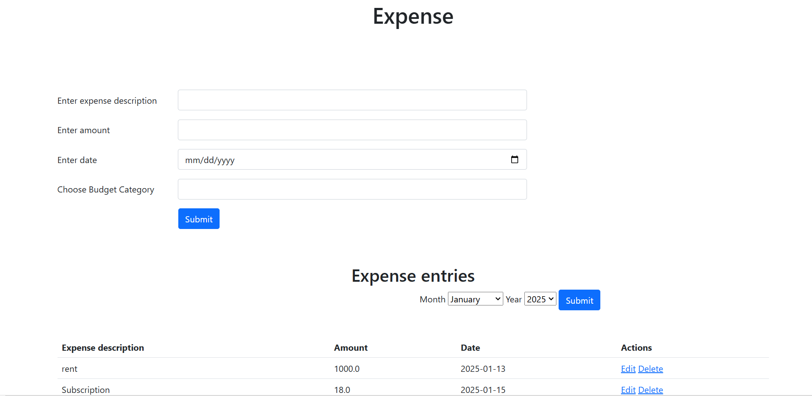
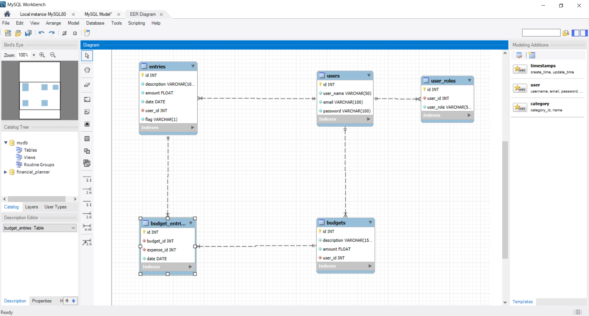

# Project-capstone
# Financial Planner
## Overview
The Financial Planner is a web application designed to keep track of user's income, budget and expenses effectively. The application is built using Spring Boot.

## Technolgies Used
**Back end**
- Spring Boot
- Spring Data JPA
- Spring security
- MySQL

**Front end**
- *MVC Architecture*: Utilizing Spring MVC for server side rendering of the web page.

**Testing**
- J Unit

**Building Tool**
- Maven

## Application Preview
### Sign Up Page

### Login Page

### Profile page

### Budget page

### Income page

### Expense page

### Financial Summary page

### EER Diagram 

